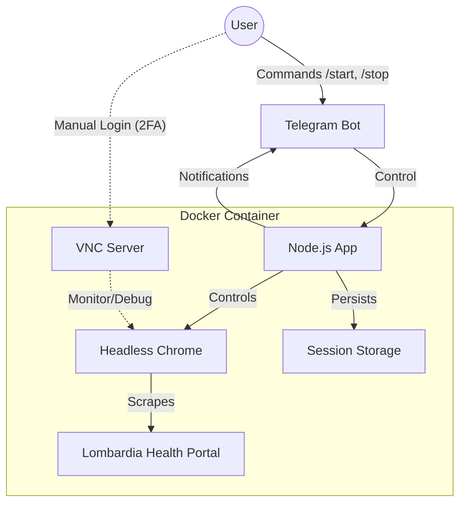
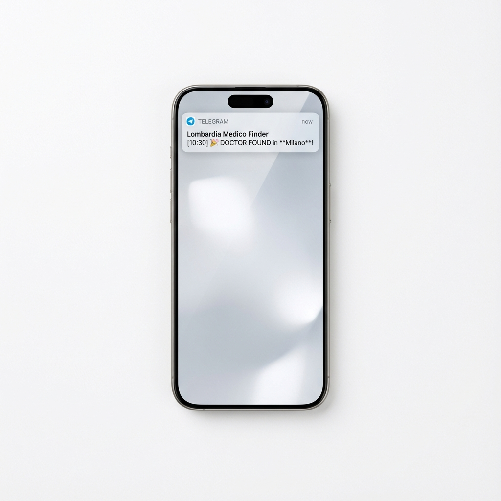
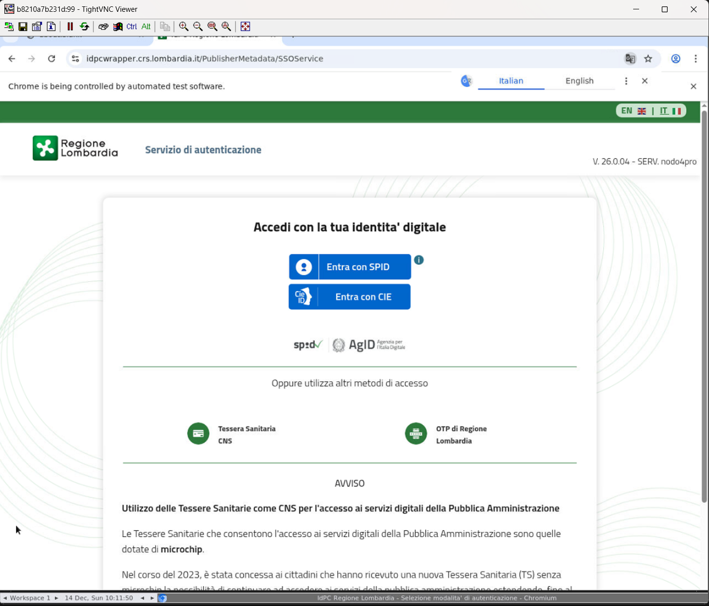

# 🏥 Cambio Medico Lombardia Automation


> ⚠️ **DISCLAIMER**: This software is intended for **educational and research purposes only**. The goal is to demonstrate RPA (Robotic Process Automation) capabilities in a containerized environment. Use responsibly and in accordance with the target website's Terms of Service.

---

## 📝 Overview

**Cambio Medico Lombardia Automation** is a containerized RPA tool for the _Fascicolo Sanitario Elettronico_.\
It automates the monitoring of family doctor availability and notifies users via Telegram.

### 🏗️ Architecture



## ✨ Features

- 🔄 **Automated Scanning**: Periodically checks for doctor availability in configured municipalities.
- 🐳 **Dockerized Environment**: Isolated execution with persistent session storage.
- 🔐 **Hybrid Authentication**: Uses VNC for initial manual login (handling SPID/CIE/2FA), then switches to automated cookies.
- 📱 **Telegram Integration**: Control the bot and receive real-time notifications with screenshots.
- 🛡️ **Error Recovery**: Automatic retry logic and process resilience.

## 📸 Preview

|                         Telegram Notification                          |             VNC Login Interface             |
| :--------------------------------------------------------------------: | :-----------------------------------------: |
|  |  |
|                  _Real-time alerts with screenshots_                   |   _Secure manual authentication via VNC_    |

## 🛠️ Prerequisites

- **Docker Engine** (20.10+) & **Docker Compose**
- **Telegram Bot Token** & **Chat ID**

## 🚀 Quick Start

### 1. 📥 Installation

```bash
git clone https://github.com/lorenzo-deluca/lombardia-medico-finder.git
cd lombardia-medico-finder
cp .env.example .env
```

### 2. ⚙️ Configuration

Edit `.env` with your credentials:

| Variable                  | Description                                 |
| :------------------------ | :------------------------------------------ |
| `TELEGRAM_BOT_TOKEN`      | Token from @BotFather                       |
| `TELEGRAM_CHAT_ID`        | Your numeric Chat ID                        |
| `VNC_PASSWORD`            | Password for VNC access (Default: `secret`) |
| `SEARCH_INTERVAL_MINUTES` | Check frequency in minutes (Default: `1`)   |

### 3. 🚢 Deployment

```bash
docker compose up --build -d
```

See [docs/synology_deployment.md](docs/synology_deployment.md) for NAS deployment.

## 🕹️ Usage

### 🔐 Authentication

Initial login requires manual interaction due to 2FA protections.

1.  Start the container.
2.  Connect to `localhost:5900` via VNC (Password: `secret`).
3.  Log in to the portal manually.
4.  The bot detects the session and begins automation.

### 🤖 Telegram Commands

| Command    | Action                             |
| :--------- | :--------------------------------- |
| `/status`  | Check service status.              |
| `/start`   | Resume monitoring.                 |
| `/stop`    | Pause monitoring.                  |
| `/restart` | Restart the application container. |

## 📂 Project Structure

```bash
lombardia-medico-finder/
├── dist/                   # Compiled JavaScript (Runtime)
├── src/
│   ├── auth.ts            # Authentication logic (Cookies/2FA)
│   ├── index.ts           # Application Entry Point
│   ├── logger.ts          # Winston logger config
│   ├── search.ts          # Core Puppeteer scanning logic
│   └── telegram.ts        # Telegram Bot wrapper
├── cookies/                # Persistent session storage (Docker Volume)
├── screenshots/            # Debug captures (Docker Volume)
├── docs/                   # Documentation & Assets
├── Dockerfile              # Multi-stage Docker build
└── docker-compose.yml      # Container orchestration
```

## 🤝 Contributing

Contributions, issues, and feature requests are welcome!
Feel free to check [issues page](https://github.com/lorenzo-deluca/lombardia-medico-finder/issues) if you want to contribute.

1.  Fork the Project
2.  Create your Feature Branch (`git checkout -b feature/AmazingFeature`)
3.  Commit your Changes (`git commit -m 'Add some AmazingFeature'`)
4.  Push to the Branch (`git push origin feature/AmazingFeature`)
5.  Open a Pull Request

See `CONTRIBUTING.md` for more details.

## 📄 License

MIT License - see [LICENSE](LICENSE).
